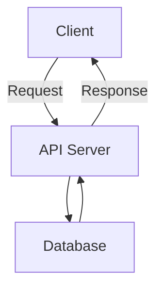

# Apna Darzi API Documentation

## Overview

This API provides endpoints for managing products, categories, fabrics, addresses, orders, user details, and agent orders for the Apna Darzi application.

## Base URL

```
https://apnadarzitailoring-5.onrender.com
```

## Authentication

Some endpoints may require authentication. Ensure to include the necessary headers if required.

## Endpoints

### Products

#### Get All Products

- **URL:** `/api/v1/products`
- **Method:** `GET`
- **Response:**
  - **Status:** `200 OK`
  - **Body:** Array of product objects

#### Get Product by ID

- **URL:** `/api/v1/products/:id`
- **Method:** `GET`
- **Response:**
  - **Status:** `200 OK`
  - **Body:** Product object

### Categories

#### Get All Categories

- **URL:** `/api/v1/category`
- **Method:** `GET`
- **Response:**
  - **Status:** `200 OK`
  - **Body:** Array of category objects

### Fabrics

#### Get All Fabrics

- **URL:** `/api/v1/fabric`
- **Method:** `GET`
- **Response:**
  - **Status:** `200 OK`
  - **Body:** Array of fabric objects

### Addresses

#### Add Address

- **URL:** `/api/v1/address`
- **Method:** `POST`
- **Request:**
  - **Headers:** `Content-Type: application/json`
  - **Body:**
    ```json
    {
      "name": "string",
      "address1": "string",
      "address2": "string",
      "pincode": "string",
      "userID": "string"
    }
    ```
- **Response:**
  - **Status:** `201 Created`
  - **Body:** Address object

#### Get Addresses

- **URL:** `/api/v1/address`
- **Method:** `GET`
- **Response:**
  - **Status:** `200 OK`
  - **Body:** Array of address objects

### Orders

#### Create Order

- **URL:** `/orders`
- **Method:** `POST`
- **Request:**
  - **Headers:** `Content-Type: application/json`
  - **Body:**
    ```json
    {
      "userID": "string",
      "items": [
        {
          "productID": "string",
          "quantity": "number"
        }
      ],
      "totalPrice": "number"
    }
    ```
- **Response:**
  - **Status:** `201 Created`
  - **Body:** Order object

### Users

#### Register User

- **URL:** `/api/register`
- **Method:** `POST`
- **Request:**
  - **Headers:** `Content-Type: application/json`
  - **Body:**
    ```json
    {
      "phoneNumber": "string",
      "otp": "string"
    }
    ```
- **Response:**
  - **Status:** `201 Created`
  - **Body:** User object

### Cart

#### Add to Cart

- **URL:** `/api/v1/cart`
- **Method:** `POST`
- **Request:**
  - **Headers:** `Content-Type: application/json`
  - **Body:**
    ```json
    {
      "userID": "string",
      "productId": "string"
    }
    ```
- **Response:**
  - **Status:** `201 Created`
  - **Body:** Cart object

### Agent Orders

#### Create Agent Order

- **URL:** `/agent`
- **Method:** `POST`
- **Request:**
  - **Headers:** `Content-Type: application/json`
  - **Body:**
    ```json
    {
      "userID": "string",
      "fabricPickedUp": "boolean",
      "measurementDone": "boolean",
      "apparelDelivered": "boolean",
      "paymentReceived": "boolean"
    }
    ```
- **Response:**
  - **Status:** `201 Created`
  - **Body:** Agent order object

## Flowchart



## Error Handling

All error responses will have the following structure:

```json
{
  "message": "string",
  "error": "string"
}
```

## Environment Variables

Ensure to set the following environment variables in your `.env` file:

```
PORT=3000
MONGO_URI=your_mongo_uri
TWILIO_ACC_SID=your_twilio_account_sid
TWILIO_AUTH_TOKEN=your_twilio_auth_token
REDIS_URL=your_redis_url
REDIS_TOKEN=your_redis_token
TWILIO_PHONE_NUMBER=your_twilio_phone_number
```

## Running the Server

To start the server, run:

````
npm start

<<<<<<< HEAD
 The client will start on the port specified in the vite.config.js file or default to port 3000.
=======

>>>>>>> 73ac6f7a2e288d03d9f026ff17e908a61e2d7f9b

### Environment Variables
Make sure to set the following environment variables in your .env file:

TWILIO_ACC_SID: Your Twilio account SID.
TWILIO_AUTH_TOKEN: Your Twilio auth token.
TWILIO_PHONE_NUMBER: Your Twilio phone number.
PORT: The port on which the server will run.
NODE_ENV: The environment in which the server is running (development or production).

PUBLIC_URL: The public URL of the client application.

### Dependencies:-
Express,
Mongoose,
Multer,
Twilio,
Redis,
Body-parser,
Cors,
Dotenv,
Path,
URL

## API Responses and Examples

### User Routes

- **POST /api/send-otp**
    - **Response**:
        ```json
        {
            "success": true,
            "message": "OTP sent successfully"
        }
        ```
    - **Example**:
        ```bash
        curl -X POST https://apnadarzitailoring-5.onrender.com/api/send-otp -d '{"phoneNumber": "+1234567890"}' -H "Content-Type: application/json"
        ```

- **POST /api/verify-otp**
    - **Response**:
        ```json
        {
            "success": true,
            "message": "OTP verified successfully"
        }
        ```
    - **Example**:
        ```bash
        curl -X POST https://apnadarzitailoring-5.onrender.com/api/verify-otp -d '{"phoneNumber": "+1234567890", "otp": "123456"}' -H "Content-Type: application/json"
        ```

- **GET /api/getUserDetails**
    - **Response**:
        ```json
        {
            "success": true,
            "data": {
                "id": "user123",
                "name": "John Doe",
                "email": "john.doe@example.com"
            }
        }
        ```
    - **Example**:
        ```bash
        curl -X GET https://apnadarzitailoring-5.onrender.com/api/getUserDetails -H "Authorization: Bearer <token>"
        ```

### Product Routes

- **GET /api/v1/products/allProducts**
    - **Response**:
        ```json
        {
            "success": true,
            "products": [
                {
                    "id": "product123",
                    "name": "Product Name",
                    "price": 100
                }
            ]
        }
        ```
    - **Example**:
        ```bash
        curl -X GET https://apnadarzitailoring-5.onrender.com/api/v1/products/allProducts
        ```

- **GET /api/v1/products/getAllCategory**
    - **Response**:
        ```json
        {
            "success": true,
            "categories": [
                {
                    "id": "category123",
                    "name": "Category Name"
                }
            ]
        }
        ```
    - **Example**:
        ```bash
        curl -X GET https://apnadarzitailoring-5.onrender.com/api/v1/products/getAllCategory
        ```

### Order Routes

- **POST /orders/create**
    - **Response**:
        ```json
        {
            "success": true,
            "order": {
                "id": "order123",
                "status": "created"
            }
        }
        ```
    - **Example**:
        ```bash
        curl -X POST https://apnadarzitailoring-5.onrender.com/orders/create -d '{"userId": "user123", "products": [{"id": "product123", "quantity": 1}]}' -H "Content-Type: application/json"
        ```

- **PUT /orders/updatestatus**
    - **Response**:
        ```json
        {
            "success": true,
            "message": "Order status updated"
        }
        ```
    - **Example**:
        ```bash
        curl -X PUT https://apnadarzitailoring-5.onrender.com/orders/updatestatus -d '{"orderId": "order123", "status": "shipped"}' -H "Content-Type: application/json"
        ```

### Profile Routes

- **POST /profile**
    - **Response**:
        ```json
        {
            "success": true,
            "profile": {
                "id": "profile123",
                "userId": "user123"
            }
        }
        ```
    - **Example**:
        ```bash
        curl -X POST https://apnadarzitailoring-5.onrender.com/profile -d '{"userId": "user123", "name": "John Doe"}' -H "Content-Type: application/json"
        ```

- **GET /profile/:userId**
    - **Response**:
        ```json
        {
            "success": true,
            "profile": {
                "id": "profile123",
                "userId": "user123",
                "name": "John Doe"
            }
        }
        ```
    - **Example**:
        ```bash
        curl -X GET https://apnadarzitailoring-5.onrender.com/profile/user123
        ```

### Address Routes

- **POST /addAddressbyuserID**
    - **Response**:
        ```json
        {
            "success": true,
            "address": {
                "id": "address123",
                "userId": "user123",
                "address": "123 Main St"
            }
        }
        ```
    - **Example**:
        ```bash
        curl -X POST https://apnadarzitailoring-5.onrender.com/addAddressbyuserID -d '{"userId": "user123", "address": "123 Main St"}' -H "Content-Type: application/json"
        ```

- **GET /list**
    - **Response**:
        ```json
        {
            "success": true,
            "addresses": [
                {
                    "id": "address123",
                    "userId": "user123",
                    "address": "123 Main St"
                }
            ]
        }
        ```
    - **Example**:
        ```bash
        curl -X GET https://apnadarzitailoring-5.onrender.com/list
        ```

### Cart Routes

- **POST /add-to-cart**
    - **Response**:
        ```json
        {
            "success": true,
            "cart": {
                "id": "cart123",
                "userId": "user123",
                "products": [
                    {
                        "id": "product123",
                        "quantity": 1
                    }
                ]
            }
        }
        ```
    - **Example**:
        ```bash
        curl -X POST https://apnadarzitailoring-5.onrender.com/add-to-cart -d '{"userId": "user123", "productId": "product123", "quantity": 1}' -H "Content-Type: application/json"
        ```

### Agent Order Routes

- **POST /createagentorder**
    - **Response**:
        ```json
        {
            "success": true,
            "agentOrder": {
                "id": "agentOrder123",
                "status": "created"
            }
        }
        ```
    - **Example**:
        ```bash
        curl -X POST https://apnadarzitailoring-5.onrender.com/createagentorder -d '{"agentId": "agent123", "orderId": "order123"}' -H "Content-Type: application/json"
        ```

- **GET /getandupdate**
    - **Response**:
        ```json
        {
            "success": true,
            "agentOrder": {
                "id": "agentOrder123",
                "status": "updated"
            }
        }
        ```
    - **Example**:
        ```bash
        curl -X GET https://apnadarzitailoring-5.onrender.com/getandupdate
        ```

### Landing Page Routes

- **POST /addLandingPageImages**
    - **Response**:
        ```json
        {
            "success": true,
            "message": "Landing page images added"
        }
        ```
    - **Example**:
        ```bash
        curl -X POST https://apnadarzitailoring-5.onrender.com/addLandingPageImages -d '{"images": ["image1.jpg", "image2.jpg"]}' -H "Content-Type: application/json"
        ```

- **GET /getLandingPageImages**
    - **Response**:
        ```json
        {
            "success": true,
            "images": ["image1.jpg", "image2.jpg"]
        }
        ```
    - **Example**:
        ```bash
        curl -X GET https://apnadarzitailoring-5.onrender.com/getLandingPageImages
        ```

### Trending Routes

- **POST /addTrendingImages**
    - **Response**:
        ```json
        {
            "success": true,
            "message": "Trending images added"
        }
        ```
    - **Example**:
        ```bash
        curl -X POST https://apnadarzitailoring-5.onrender.com/addTrendingImages -d '{"images": ["image1.jpg", "image2.jpg"]}' -H "Content-Type: application/json"
        ```

- **GET /getTrendingPageImages**
    - **Response**:
        ```json
        {
            "success": true,
            "images": ["image1.jpg", "image2.jpg"]
        }
        ```
    - **Example**:
        ```bash
        curl -X GET https://apnadarzitailoring-5.onrender.com/getTrendingPageImages
        ```

### Fashion Routes

- **POST /addFashionImages**
    - **Response**:
        ```json
        {
            "success": true,
            "message": "Fashion images added"
        }
        ```
    - **Example**:
        ```bash
        curl -X POST https://apnadarzitailoring-5.onrender.com/addFashionImages -d '{"images": ["image1.jpg", "image2.jpg"]}' -H "Content-Type: application/json"
        ```

- **GET /getFashionPageImages**
    - **Response**:
        ```json
        {
            "success": true,
            "images": ["image1.jpg", "image2.jpg"]
        }
        ```
    - **Example**:
        ```bash
        curl -X GET https://apnadarzitailoring-5.onrender.com/getFashionPageImages
        ```

### Category Routes

- **GET /fetchcategories**
    - **Response**:
        ```json
        {
            "success": true,
            "categories": [
                {
                    "id": "category123",
                    "name": "Category Name",
                    "image": "category.jpg"
                }
            ]
        }
        ```
    - **Example**:
        ```bash
        curl -X GET https://apnadarzitailoring-5.onrender.com/fetchcategories
        ```

- **POST /addCategoryData**
    - **Response**:
        ```json
        {
            "success": true,
            "category": {
                "id": "category123",
                "name": "Category Name"
            }
        }
        ```
    - **Example**:
        ```bash
        curl -X POST https://apnadarzitailoring-5.onrender.com/addCategoryData -d '{"name": "Category Name", "image": "category.jpg"}' -H "Content-Type: application/json"
        ```

### Click Routes

- **POST /trackClick**
    - **Response**:
        ```json
        {
            "success": true,
            "message": "Click tracked"
        }
        ```
    - **Example**:
        ```bash
        curl -X POST https://apnadarzitailoring-5.onrender.com/trackClick -d '{"elementId": "button123"}' -H "Content-Type: application/json"
        ```

- **GET /getClickStats**
    - **Response**:
        ```json
        {
            "success": true,
            "stats": {
                "elementId": "button123",
                "clicks": 10
            }
        }
        ```
    - **Example**:
        ```bash
        curl -X GET https://apnadarzitailoring-5.onrender.com/getClickStats
        ```

### Order Summary Routes

- **POST /ordersummary**
    - **Response**:
        ```json
        {
            "success": true,
            "orderSummary": {
                "id": "summary123",
                "userId": "user123"
            }
        }
        ```
    - **Example**:
        ```bash
        curl -X POST https://apnadarzitailoring-5.onrender.com/ordersummary -d '{"userId": "user123", "orderId": "order123"}' -H "Content-Type: application/json"
        ```

- **GET /ordersummary/:userId**
    - **Response**:
        ```json
        {
            "success": true,
            "orderSummary": {
                "id": "summary123",
                "userId": "user123",
                "orderId": "order123"
            }
        }
        ```
    - **Example**:
        ```bash
        curl -X GET https://apnadarzitailoring-5.onrender.com/ordersummary/user123
        ```

### Personal Details Routes

- **GET /listpersonal**
    - **Response**:
        ```json
        {
            "success": true,
            "personalDetails": {
                "userId": "user123",
                "name": "John Doe",
                "email": "john.doe@example.com"
            }
        }
        ```
    - **Example**:
        ```bash
        curl -X GET https://apnadarzitailoring-5.onrender.com/listpersonal -H "Authorization: Bearer <token>"
        ```

- **POST /uploadProfilePicture**
    - **Response**:
        ```json
        {
            "success": true,
            "message": "Profile picture uploaded"
        }
        ```
    - **Example**:
        ```bash
        curl -X POST https://apnadarzitailoring-5.onrender.com/uploadProfilePicture -F "profilePicture=@/path/to/picture.jpg" -H "Authorization: Bearer <token>"
        ```

- **POST /addOrUpdate**
    - **Response**:
        ```json
        {
            "success": true,
            "personalDetails": {
                "userId": "user123",
                "name": "John Doe",
                "email": "john.doe@example.com"
            }
        }
        ```
    - **Example**:
        ```bash
        curl -X POST https://apnadarzitailoring-5.onrender.com/addOrUpdate -d '{"userId": "user123", "name": "John Doe", "email": "john.doe@example.com"}' -H "Content-Type: application/json"
        ```

- **PUT /edit/:userID**
    - **Response**:
        ```json
        {
            "success": true,
            "message": "Personal details updated"
        }
        ```
    - **Example**:
        ```bash
        curl -X PUT https://apnadarzitailoring-5.onrender.com/edit/user123 -d '{"name": "John Doe", "email": "john.doe@example.com"}' -H "Content-Type: application/json"
        ```

<<<<<<< HEAD
=======

>>>>>>> 73ac6f7a2e288d03d9f026ff17e908a61e2d7f9b
````
